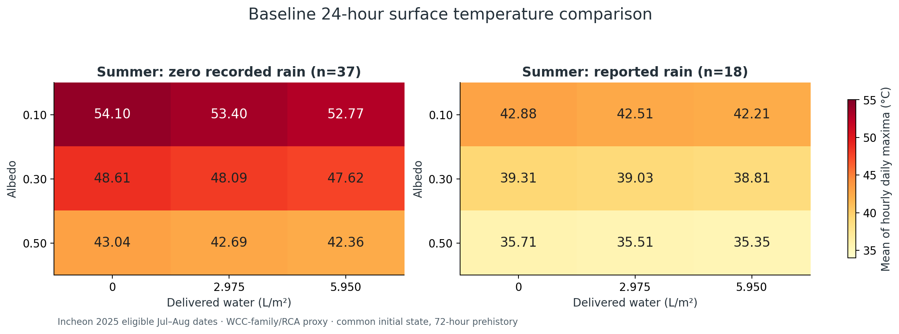

# Geoscience: 반사율·증발과 포장 열수지

**2026-09-26 — 사용자 최종 승인 후 시뮬레이션·분석 완료.** 위5cm WCC계열 콘크리트와 아래25cm RCA 문헌 대리 지지층의 온도·수분 네 상태를 계산했다. 인천2025년1–2월·7–8월 후보에서 기준 비교56일(여름55, 겨울1), 모든 민감도 공통 여름50일을 사용했다.

먼저 [최종 결과 보고서](docs/final-results.md)를 읽는다. [전체 결과·재현 안내](results/README.md)에 압축 시간별 결과, CSV, 그림과 실행 방법이 있다. [실행·검토 기록](docs/final-execution-record.md), [입력값·출처·가정](docs/preflight-input-evidence.md), [비교·민감도 설계](docs/experiment-design.md), [이전 대화 인수](docs/conversation-handoff-2026-09-26.md)를 함께 보존했다.

- 여름 기록상 무강수37일에서 무살수 일최고 표면온도의 평균은 반사율0.10/0.30/0.50 순으로 **54.10/48.61/43.04°C**였다. 5.95 L/m²의 추가 살수 저하는 각각1.33/0.98/0.69°C였다.
- 높은 반사율에서 증발량도 작아졌고 반사 단파는 커졌다. 표면온도만으로 보행자에게 최적인 반사율을 정하지 않았다.
- 기준 탐색 구간0–5.95 L/m² 내95% 최소 공급량은 **5.6525 L/m²**,90%는 **5.355 L/m²**였다. 최대는 상한에서 나왔으며 평탄부·범위 밖 최적값을 확인하지 못했다.
- 시간 간격 수렴과 보존 검사는 통과했다. 하지만72/168시간 과거 강수 이력의 영향이 남아 결과와 물량 후보는 **기준 초기화·대리 물성에 조건부**다. 겨울1일은 계절 대표 결과가 아니다.



## 무엇이 확보됐는가

- 인천112의2025년 시간관측8,736행과 공식 일강수182일. 원본/QC/보완 사유/해시를 보존한 [기상묶음](data/preflight/incheon2025-weather.json.gz).
- WCC계열 Con-W 열물성, 보수성 콘크리트 저장량, RCA 지지층 대리 물성, 대기 경계 문헌. [원문 URL·해시](data/reference-manifest.json).
- [실행 입력](config/research-inputs.json): 문헌 실측/역추정·환산·다른 재료 대리·모델 가정을 명시. 기준 포함30시나리오와 살수5%격자.
- 121후보 중24시간 기상99일,72시간 사전 구간 등까지 정적으로 준비된60일. 이는 승인 전 정적 개수이며, 실제 기준 적분에서는 동결4일을 제외해56일이 남았다. [날짜별 제외 사유](data/preflight/manifest.json).

**동일 Wang WCC 배합의 완전한 실측 물성 세트는 확보되지 않았다.** 서로 다른 콘크리트 문헌값을 결합한 대리 연구이며 현장 예측 검증이 아니다. 열용량의 수분 중복, 기층 공극률과 다른 논문 포화량 혼합, 살수량을 저장량으로 취급하는 오류를 피했다.

반사율이 높으면 흡수열과 증발량이 함께 줄 수 있다. 증발이 활발해도 유입열이 크면 온도가 오를 수 있으므로 열·물수지를 동시에 비교한다. 반사 단파와 물 사용량도 보고하며 높은 반사율을 자동 추천하지 않는다. 반사 단파는 보행자 체감온도나 안전지표가 아니다.

## 준비 재현

Python3.10이상, 표준라이브러리만 사용한다.

```sh
python3 -m unittest discover -s tests -v
python3 scripts/prepare_research.py --annual '/실제/2025년_시간단위_전체데이터.csv'
```

Git에 기상묶음이 포함되어 있어 원본 Downloads 경로 없이 준비된 입력을 읽을 수 있다. 두 번째 명령은 원본으로 준비물을 다시 생성할 때만 필요하다. 입력 조립과 점검은 적분하지 않는다. 승인 후 실행·결과 재생성 명령은 [결과 안내](results/README.md)에 있다. 입력 JSON의 실행 잠금은 승인 전 준비 기록으로 보존했고, 이번 실행 승인은 별도 영수증과 CLI 플래그로 남겼다.

## 코드와 근거

- [`model.py`](src/geoscience/model.py): 물·열 보존, 가용수 제한, 배수·유출·동결 범위 중단. 보존형1차 명시법.
- [`simulate.py`](src/geoscience/simulate.py): 명시적 재료 설정, β증발법칙·저장비 교환법칙 및 연구실행 잠금.
- [`weather.py`](src/geoscience/weather.py): KST 누적량/QC/눈 처리, 대기경계 추정. [처리 근거](docs/weather-integration.md).
- [`preflight.py`](src/geoscience/preflight.py), [`comparison.py`](src/geoscience/comparison.py): 사전 적분과9조건의 입력 조립, 해시 확인, 승인 이후 짝비교·물량 기준 계산 경로.
- [제한된 대기·RCA 재검증](docs/preflight-boundary-source-audit.md), [WCC 원문 확보/공백](docs/wcc-source-search-2026-09-26.md), [작업·검증 기록](docs/preflight-worklog.md).

`examples/solver-smoke.json`은 합성 수치시험이며 연구 재료가 아니다. 기존 합성 보존·해석해·수렴 테스트는 현장 검증과 다르다. 최신 설계는 동결·응결·연속깊이·도시기온·보행자 체감 계산을 포함하지 않는다.

`output/pdf/core-equations.pdf`와 `concrete-model-draft.pdf`는 이전 방정식 설명용 문서다. 특히 core-equations는 옛 세 상태 모형이다. 현재 실행 명세는 이README와 최신 입력/실험 설계를 따른다. LaTeX 원본의 별도 컴파일 검증을 완료했다는 뜻도 아니다.
