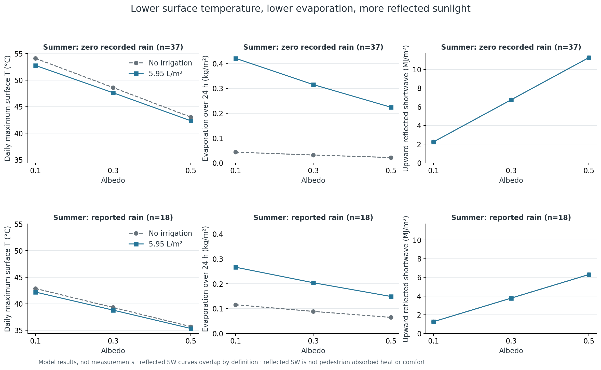
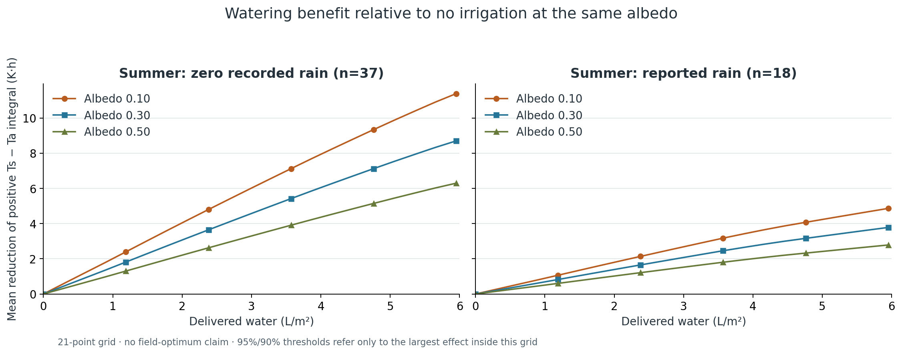
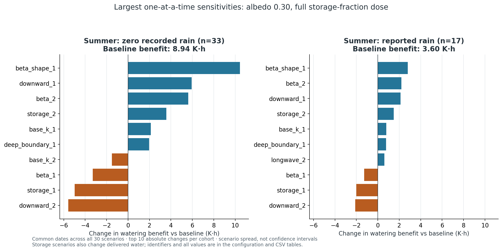

# 반사율·살수·증발의 최종 수치 비교

**2026-09-26 · 사용자 최종 승인 후 실행 완료.** 인천 2025 기상에 WCC 계열 5 cm / RCA 문헌 대리 지지층 25 cm를 적용했다. 기준 3×3, 기준 포함 30개 입력 민감도, 21단계 물 공급량, 시간 간격 및 초기화 점검을 완료했다. 원래 연구의 반사·증발 결합과 제한된 물 사용이라는 방향을 유지했다.

**이번 기준 조건에서는 반사율 상승의 표면 냉각 효과가 살수의 추가 냉각보다 컸다. 반사율이 높아지면 증발량과 살수의 추가 효과도 작아졌고, 위로 반사된 태양복사는 커졌다.** 따라서 표면온도가 가장 낮았다는 이유만으로 반사율 0.50을 보행환경 최적값으로 선택하지 않는다. 공급량 후보는 95% 기준 **5.6525 L/m²**, 90% 기준 **5.355 L/m²**지만, 이는 **0–5.95 L/m² 탐색 구간과 72시간 초기화·기준 대리 물성에 조건부인 값**이다. 범위를 벗어난 진정한 최대 효과나 현장 최적량을 찾았다는 뜻이 아니다.

## 계산 범위와 표본

날짜별 06–다음06시 24시간, 06–07시에 정해진 총량을 균등 공급했다. 사전 72시간에는 반사율 0.30과 실제 강수를 적용하고, 그 마지막 네 상태를 모든 반사율·물량에 복제했다. **같은 아침 초기상태에서 시작하는 하루 비교**이며 각 반사율 포장의 장기 평형 비교는 아니다. 설정·원문·가정은 [입력 근거](preflight-input-evidence.md), [실험 설계](experiment-design.md), [입력 JSON](../config/research-inputs.json)에 있다.

| 계절·평가24시간 강수군 | 정적 준비 완료 | 기준·물량 세분화 완료 | 모든 민감도 공통 |
|---|---:|---:|---:|
| 겨울 기록상 무강수 | 5 | 1 | 0 |
| 겨울 유강수 | 0 | 0 | 0 |
| 여름 기록상 무강수 | 37 | 37 | 33 |
| 여름 유강수 | 18 | 18 | 17 |
| 합계 | 60 | 56 | 50 |

전체 후보는 121일이다. 기상24시간 준비99일 → 사전 구간·물 온도까지 준비60일 → 기준 적분56일이다. 기준에서 겨울4일은 젖은 층의 동결로 날짜 전체가 제외됐다. 남은 겨울은 **2025-02-28 하루**라서 겨울 계절 결론을 내리지 않는다. 겨울 유강수와 겨울 전체 시나리오 비교는 **0일, 최소량 판단 없음**이다.

모든 민감도 공통 날짜는 여름50일이다. 168시간 자료 가용성, 초기 기층수량·장파 하한 등의 동결 제외가 날짜 교집합을 줄였다. 기준56일 결과와 민감도 공통50일 결과를 혼합하지 않았으며, 기준을 공통 날짜에 제한한 요약도 별도 `scope`로 제공한다. 실제 날짜는 [summary.json](../results/summary.json), 모든 제외 사유는 [원자료](../results/raw/)에 있다. 기록상 무강수일에도 이전 비의 물이 남을 수 있다. 이 표본은 계절 전체의 무작위·대표 표본이 아니다.

## 1. 표면온도: 반사율과 살수의 효과

다음 값은 **날짜별 시간 끝점 최고 표면온도를 평균한 값**이다. 연속시간의 정확한 최고값, 실측 포장온도, 보행자 체감온도가 아니다.

| 반사율 | 여름 무강수37일: 무살수 | 2.975 L/m² | 5.950 L/m² | 5.95의 추가 저하 |
|---|---:|---:|---:|---:|
| 0.10 | 54.10°C | 53.40°C | 52.77°C | 1.33°C |
| 0.30 | 48.61°C | 48.09°C | 47.62°C | 0.98°C |
| 0.50 | 43.04°C | 42.69°C | 42.36°C | 0.69°C |

| 반사율 | 여름 유강수18일: 무살수 | 2.975 L/m² | 5.950 L/m² | 5.95의 추가 저하 |
|---|---:|---:|---:|---:|
| 0.10 | 42.88°C | 42.51°C | 42.21°C | 0.67°C |
| 0.30 | 39.31°C | 39.03°C | 38.81°C | 0.50°C |
| 0.50 | 35.71°C | 35.51°C | 35.35°C | 0.36°C |

추가 저하는 같은 반사율 무살수와의 **일최고값 차이의 평균**이다. 최고값 발생 시각이 달라질 수 있어 동일 시각 온도차와는 다르다. 여름 무강수에서 α=0.10 무살수와 α=0.50·5.95 L/m²의 일최고 평균 차이는 약11.75°C였다. 이는 반사와 살수를 함께 바꾼 처리 차이이지 증발만의 효과가 아니다.

근거: [기준 요약 CSV](../results/baseline_summary.csv)의 `scope=baseline_all`. 평균온도·양의 Ts−Ta 누적값·최종 수분 및 전체 열/물 장부도 같은 표에 있다.

## 2. 높은 반사율은 증발을 줄여도 표면을 더 식혔다

아래는 **5.95 L/m² 공급 조건, 여름 기록상 무강수37일 평균**이다.

| 반사율 | 24시간 증발량 | 같은 반사율 무살수보다 증가한 증발량 | 살수 효과 A 감소 | 위로 반사된 단파 |
|---|---:|---:|---:|---:|
| 0.10 | 0.421 kg/m² | 0.378 kg/m² | 11.379 K·h | 2.254 MJ/m² |
| 0.30 | 0.315 kg/m² | 0.283 kg/m² | 8.695 K·h | 6.763 MJ/m² |
| 0.50 | 0.224 kg/m² | 0.202 kg/m² | 6.293 K·h | 11.271 MJ/m² |

`A=∫max(Ts−Ta,0)dt`이며, 살수 효과는 같은 반사율 무살수 A−살수 A다. 이 지표는 표면이 기온보다 높은 시간의 누적 초과온도이지 사람의 열 노출량이 아니다.

α=0.10→0.50에서 증발량은 줄었지만 일최고 표면온도도 낮아졌다. 이번 조건에서는 반사 증가로 흡수 단파가 줄어든 효과가 함께 작용했기 때문이다. 반대로 α=0.10은 증발이 더 많아도 더 뜨거웠다. 따라서 **증발량이 가장 많음=표면온도가 가장 낮음**으로 판단할 수 없다. 증발은 끓는점에 도달해야만 일어나는 과정도 아니며, 모형에서는 표면온도·수증기압 차·공기측 저항·표면수량에 반응한다.

정의한 상호작용 `I=A(α,w)−A(α,0)−A(0.10,w)+A(0.10,0)`은 α=0.50·5.95에서 **+5.086 K·h**다. 양수는 이 경우 두 단독 효과를 단순히 합한 것보다 결합 효과가 작다는 뜻이다. 반사율 상승으로 살수의 추가 효과가 줄어드는 관계와 일치한다. 이를 상승적 시너지라고 부르지 않는다.

반사 단파 증가는 실제 보행자가 받는 열 증가량으로 곧바로 바꿀 수 없다. 인체·건물의 기하, 시야율, 차폐, 흡수율을 계산하지 않았으므로 **MRT·UTCI·눈부심·안전 판정은 하지 않았다.** 표면 냉각만으로 높은 반사율을 최종 추천하지 않은 이유다.

근거: [기준 열/물 장부 CSV](../results/baseline_summary.csv). 반사 단파는 α×관측 기반 입사 단파로 계산되어 같은 반사율에서는 살수 유무 곡선이 겹친다.

## 3. 사용자가 선택한 95%·90% 최소 물 공급량

공급량 0–5.95 L/m²를 **0.2975 L/m² 간격(저장 기준량의5%)**으로 비교했다. 같은 반사율의 무살수 대비 **평균 A 감소**가 격자 최대 감소량의95% 또는90%에 처음 도달하는 점을 선택했다.

| 평가 집단 | 반사율 | 격자 최대효과 공급량 | 최대효과의95% 최소량 | 최대효과의90% 최소량 |
|---|---|---:|---:|---:|
| 여름 기록상 무강수37일 | 0.10 / 0.30 / 0.50 각각 | 5.9500 | **5.6525** | **5.3550** |
| 여름 유강수18일 | 0.10 / 0.30 / 0.50 각각 | 5.9500 | **5.6525** | **5.3550** |

단위는 모두 L/m²다. 모든 민감도 공통 날짜로 제한해도 기준 물성의 이 세분화 후보는 같았다. 겨울2월28일 한 사례에서도 같은 격자 후보가 나왔지만 겨울 권장량으로 확대하지 않는다. 겨울 공통 민감도 집단에는 결과가 없다.

**최대값은 탐색 상한5.95에서 나왔고, 이 범위에서 뚜렷한 평탄부를 확인하지 못했다.** 따라서5.6525는 무제한 물 공급에서 가능한 최대 냉각의95%를 보장하지 않는다. 선택한 범위 안에서 물을5% 줄여 효과95% 이상을 유지하는 후보이며,90% 후보는 물을10% 줄인 점이다. 정확한 연속 최적값·강한 물 절감 전환점·현장 살수 권장량을 발견했다고 결론내리지 않는다. 공급량 탐색을 상한 밖으로 임의 확장하지 않았다.

근거: [21단계 효과 곡선 CSV](../results/dose_response.csv), [최소 공급량 CSV](../results/water_choices.csv). 기준 외 29개 시나리오에는 3단계 물량만 적용했으므로 이 최소량이 모든 물성 가정에서도 안정적이라는 뜻이 아니다.

## 4. 공급한 물 전부가 증발 냉각에 쓰이지 않았다

여름 기록상 무강수, α=0.30·5.95 공급의 평균 물 장부는 다음과 같다.

| 항목 | kg/m² |
|---|---:|
| 평가 시작 위층 / 아래층 저장수 | 0.341 / 2.047 |
| 공급 / 평가 중 강수 | 5.950 / 0 |
| 증발 | 0.315 |
| 하부 배수 | 2.396 |
| 표면 유출 | 0.227 |
| 평가 종료 위층 / 아래층 저장수 | 0.554 / 4.846 |
| 위층→아래층 이동(내부 이동, 총량에서 중복 차감 금지) | 5.195 |

같은 반사율 무살수 대비 **증발 증가분은0.283 kg/m²**로, 공급량5.95보다 훨씬 작다. 증발 총량에는 이전 강수의 잔류수도 포함되며 물 분자 추적은 하지 않았다. 적은 β와 하향이동·배수라는 현재 가정 아래에서는 물의 상당 부분이 이동·배수되거나 하루 종료 때 남는다. 위층수량은 완전히0이 되어야만 증발이 약해지는 것이 아니며 기준 β는 저장비에 비례해 줄어든다.

이 조건의 평균 열 장부에서 흡수 단파15.779, 순장파−5.563, 대류 유출7.277, 증발잠열 유출0.772, 하부전도 유출1.982, 물 이동의 순 현열 유입0.266 MJ/m²다. 부호를 따라 저장열 변화와 함께 합쳐야 한다. 살수는 물의 현열과 열용량도 바꾸므로 온도차 전체를 잠열 단독 효과라고 부르지 않는다.

## 5. 민감도: 효과 크기는 가정에 크게 의존한다

모든 30시나리오의 공통 여름 날짜에서, 저장 기준량1배 공급의 평균 살수효과 A 감소 범위다. 저장량 민감도 두 개는 절대 공급량도 달라지므로 모든 행이 동일 L/m²의 비교는 아니다.

| 반사율 | 기록상 무강수33일 OAT 범위 | 유강수17일 OAT 범위 |
|---|---:|---:|
| 0.10 | 4.409–26.328 K·h | 1.912–8.378 K·h |
| 0.30 | 3.370–19.392 K·h | 1.494–6.403 K·h |
| 0.50 | 2.450–13.383 K·h | 1.112–4.592 K·h |

공통 날짜 기준 α=0.30의 기준 효과는 무강수8.944, 유강수3.600 K·h다. 효과가 가장 작았던 시나리오는 하향이동 상한4 mm/h(`downward_2`), 가장 컸던 것은 물이 있는 동안 일정한 β를 쓰는 형태(`beta_shape_1`)였다. 이 결과는 **표면에 물이 얼마나 남고 어떻게 증발 가능한 상태를 유지하는지에 관한 가정이 핵심**임을 보여준다. 이 범위는95% 신뢰구간이나 가능한 모든 물성 조합의 범위가 아니다. OAT는 한 항목씩만 바꾼다.

각 변경값은 [입력 JSON의 sensitivity](../config/research-inputs.json), 전체 수치는 [민감도 CSV](../results/sensitivity_summary.csv), 범위와 극값 시나리오는 [범위 CSV](../results/sensitivity_ranges.csv)에 있다.

## 6. 수치·초기화 검증과 해석의 경계

| 점검 | 결과 | 판정 |
|---|---:|---|
| 20→10초, 공통56일·9조건·25시각의 최대 Ts 차이 | 0.010885 K | 0.05 K 이하 |
| 10→5초, 같은 비교의 최대 Ts 차이 | 0.005434 K | 0.05 K 이하 |
| 초기온도−3/+3 K 후72시간, 평가 중 최대 Ts 차이 | 0.000505 / 0.000516 K | 초기 온도 오차 충분히 감소 |
| 72→168시간 이력, 공통51일 최대 Ts 차이 | 2.121533 K | 초기상태 비의존성 미달 |
| 72→168시간, 최대 살수효과 차이 | 5.892922 K·h | 조건부 해석 필요 |
| 모든 완료 평가·예열 장부의 최대 물 잔차 | 6.350×10⁻¹¹ kg/m² | 10⁻⁶ 이하 |
| 같은 범위의 최대 열 잔차 | 2.082×10⁻⁶ J/m² | 0.1 이하 |

168시간 이력에는 추가 강수가 들어가므로 차이를 단순 수치 오차로 취급하지 않았다. 72시간 초기화에서 얻은 온도·효과·물량을 조건부 결과로 남기고, 초기 수분상태와 무관한 최적량이라는 해석은 보류했다. 시간 간격 수렴은 기본3×3에 대해 확인한 것이며 모든 민감도·21단계의 개별 시간 간격 수렴을 반복 검증한 것은 아니다.

전체 단계에 기록된 평가 처리 결과는22,572개이며 단계 사이 재사용된 조건을 포함한다. 이를 독립 표본22,572개라고 해석하지 않는다. 물리 적분 코드와 입력은 준비 때 고정한 상태를 유지했다. 55개 자동 테스트, 결과 장부 재계산 및 독립 검토를 수행했다. [진단 원자료](../results/gates.json), [보존·파일 검증](../results/verification.json), [실행·검토 기록](final-execution-record.md)을 참조한다.

## 최종 연구 결론

이번 문헌 대리모형·기상·초기화 조건에서는 높은 반사율이 표면온도를 크게 낮췄지만 증발과 살수의 추가 효과를 줄이고 반사 단파를 늘렸다. 반사와 증발을 함께 고려해야 한다는 원래 문제의식은 유지되며, 두 효과를 독립적으로 더해서 결합 이득을 과장할 수 없다. 물량95%/90% 후보는 계산했지만 탐색 상한 근처에 있고 물성·강수 이력 의존성이 커서 보편 최적량이나 현장 권장량으로 확정할 근거는 없다.

**현 단계의 완료 결과는 재현 가능한 조건부 수치 비교다.** 실제 WCC 배합의 완전한 실측 물성, 현장 온도 검증, 보행자 복사·체감 계산은 포함하지 않았다. 이를 해결하기 위해 연구 범위를 임의로 바꾸거나 누락값을 만들어 넣지 않았다. [전체 결과·재현 안내](../results/README.md)에서 원자료·표·그림을 확인할 수 있다.
